# Chordic Keyboard Layout (For the 42-Key Corne/crkbd)
### _A chord-heavy layout built for instantaneousness_

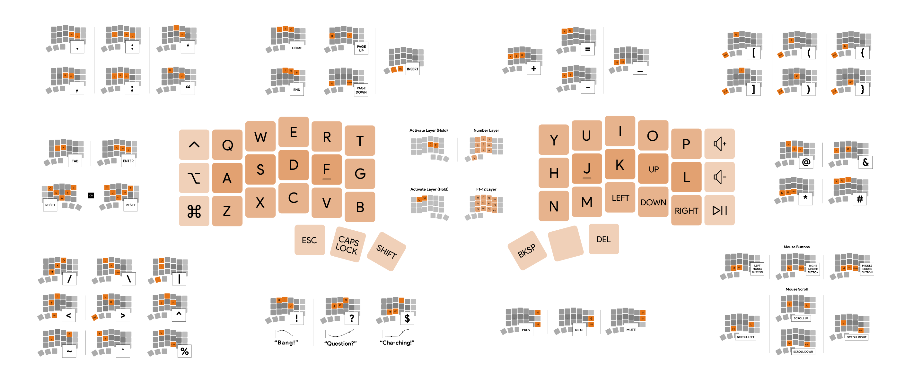

_**Summary**: This layout heavily relies on **chording** for symbols and actions. All letters, symbols, arrow keys, media keys, and modifiers are **instantaneous** without the need for layers, hold activation, or double taps, making this layout fast and friendly for **software keyboard shortcuts and passwords**. Chord positions are intuitive and created with **mnemonics** in mind. Layers are only reserved for number keys and function keys._

-------------------
|**Content**      |
|-----------------|

1. [Introduction](#introduction)
   - [Why Only a 42-Key, 40% Keyboard?](#why-only-a-42-key-40-keyboard)
   - [What is a Chord?](#what-is-a-chord)
   - [Considerations](#considerations)
2. [Base Layout](#base-layout)
   - [Arrow Keys](#arrow-keys)
   - [QWERTY](#qwerty-default)
   - [Dvorak, Colemak, & Workman](#dvorak-colemak--workman-optional)
   - [Modifier Keys](#modifier-keys)
   - [Thumb Clusters](#thumb-clusters)
   - [Media Keys](#media-keys)
3. [Layers](#layers)
   - [Number Layer](#number-layer)
   - [Function Key Layer](#function-key-layer)
4. [Symbol Chords](#symbol-chords)
   - [Common Symbols](#common-symbols)
   - [Basic Math Symbols](#basic-math-symbols)
   - [Parentheses](#parentheses)
   - [Shapes](#shapes)
   - [Intonation](#intonation)
   - [Association](#association)
5. [Action Chords](#action-chords)
   - [Common Actions](#common-actions)
   - [Navigation Chords](#navigation-chords)
   - [Additional Media Chords](#additional-media-chords)
   - [Mouse Chords](#mouse-chords)
   - [Misc Chords](#misc-chords)
6. [Conclusion](#conclusion)
7. [Resources](#resources)

------
## Introduction
### Why Only a 42-Key, 40% Keyboard?
On standard keyboards, many keys require reaching, like the number keys, symbols, etc. **A smaller keyboard reduces finger movement and can greatly increase ergonomics**. The tradeoff to having less keys is generally more complicated usability – the Chordic layout tries to find the sweet spot.
### What is a Chord?
Chords, also known as combos or macros, are **multiple keys pressed together that result in a new action**. Chording is used in stenography and feels similar to playing chords on a piano.
### Considerations
* **The learning curve** – there will be chord memorization, but they are designed to be memorable.
* **The “L” key has moved** – it takes getting used to. Read why in the [“QWERTY” section](#qwerty-default).
* **Accidental letters** – if a chord’s keys aren’t pressed together, the result may be individual characters rather than the intended chord.
* **Accidental chords** – there are many letter pairs that appear within words. In that last sentence alone, “E” and “R” appeared together 4 times. This layout avoids using E-R as a chord and many other commonly paired letters so that typing a word with “E-R” doesn’t activate a chord’s action. This issue has not been a problem for me.
* **Lighter keyboard switches** - recommended for chording multiple keys at a time, I use 50g.
* **An external trackball is necessary for mouse directional keys** – read more in the [“Mouse Chords” section](#mouse-chords).
* **Keyboard layouts are highly personal** – I don’t expect this to work for everyone. Experiment! 

------
## Base Layout
### Arrow Keys
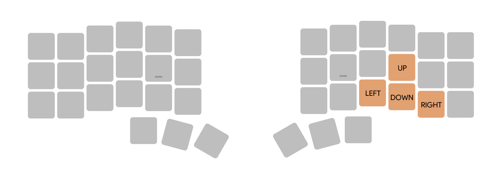
**Arrows are used often and placed on the base layer**. This layout also makes the **arrow keys easy to be used with modifiers**. While I’ve seen the single-row DDR-style positioning of arrows (←↓↑→), the **inverted-T arrow configuration is more intuitive**. The downside is that the “L” key is moved one space to its right.

### QWERTY (Default)
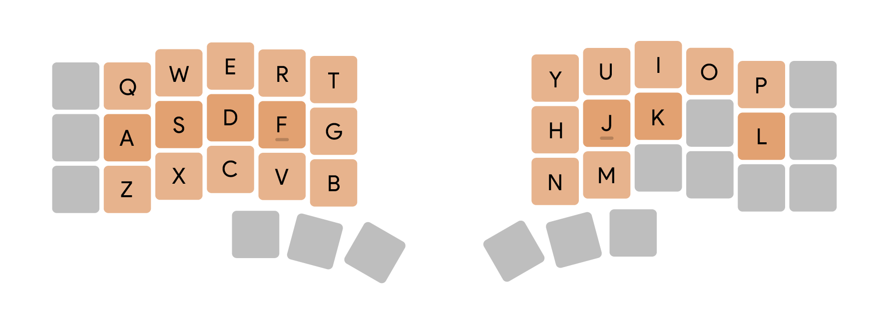
The main reason I use QWERTY is that it’s what I’m used to, but there are **three reasons the Chordic layout works well with QWERTY + arrow keys**:
1. **The chords chosen within this Chordic layout avoid common letter pairings specific to the QWERTY layout**. A chord made up of letters that are common within words (like “A-S”), may be accidentally activated when typing a word quickly (words like “f-A-S-t”), which is why Chordic does not use the chord “A-S.” 
2. **Home row chords benefit from QWERTY’s less common keys on its home row**. Chords positioned on or near the home row are more convenient – but the more common letters on the home row, the higher the potential for words misfiring as chords.

3. **The Up key on the right-hand home row benefits chording**. A chord that utilizes an arrow key and a letter key is far less likely to misfire since these two types of keys are not generally typed in succession. The Up key can be easily paired with letters to make safe chords. 

### Dvorak, Colemak, & Workman (Optional)
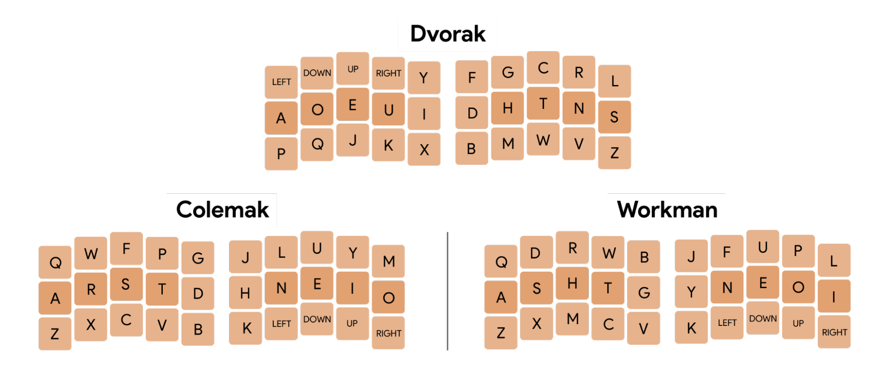
**All chords in the Chordic layout are key-position based rather than letter-based. Feel free to try to swap in non-QWERTY layouts**. Within the popular alternative layouts, I’ve moved one letter each to prioritize the grouped arrow keys. The Chordic layout is built around avoiding accidental chords within QWERTY only – **non-QWERTY layouts are untested** and may include chords that fall on common letters.

### Modifier Keys
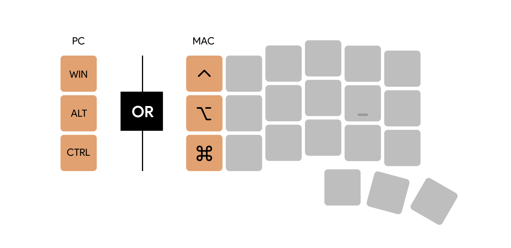
The modifier column is **ordered from most accessible/common keys from bottom to top**. Default layout is Mac. To swap to the PC layout, go to the [“Misc Chords” section](#misc-chords). **Modifiers are instantaneous**. Other layouts require a key to be held to change it into a modifier, but this adds a delay and can create misfires. **Also, this layout parallels how software keyboard shortcuts are written** – modifiers on the left, other key(s) on the right. 

### Thumb Clusters
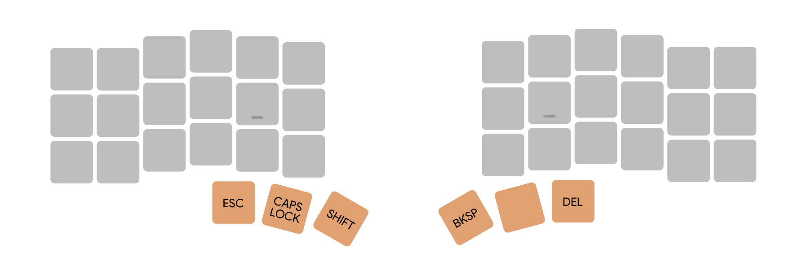
The thumbs are stronger, so **common actions are moved away from weak pinkies**. On Mac, Caps Lock on some external keyboards has a delay; either hold the chord to activate or install [Karabiner](https://karabiner-elements.pqrs.org/) to remove the delay. In this position, **Shift easily capitalizes any letter on either side of the keyboard**. Backspace, Space, and Delete – **all basic text keys are assigned to the right thumb**. They are ordered chronologically in the direction they manipulate text. The lack of Tab/Enter keys is explained in the [“Control Key Chords” section](#control-key-chords).

### Media Keys
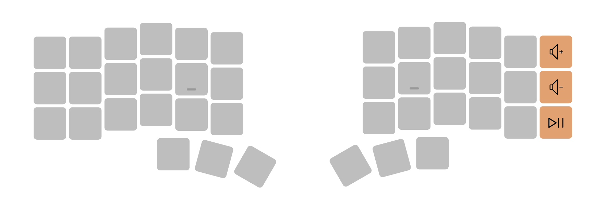
**This layout prioritizes control over audio**. The chords for Next, Previous, and Mute buttons are within the [“Additional Media Chords” section](#additional-media-chords).

------
## Layers
### Number Layer
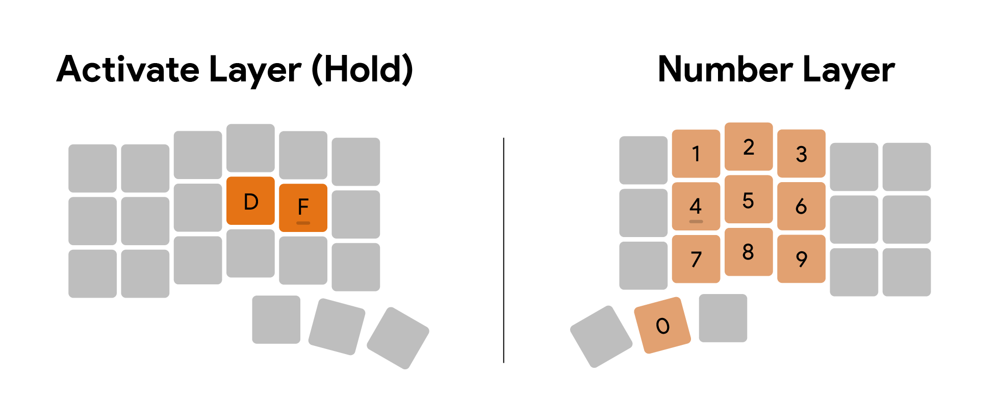
The number layer is activated by holding D+F. On the right side, the numbers are **ordered chronologically, top-down** with 0 on the spacebar. **Double-tap D+F to activate this layer without the need to hold D+F**. Hitting Escape returns to base layer. For keyboard shortcuts that include a number, **this layer is also activated with W+D so modifiers are more comfortably within reach**.

### Function Key Layer
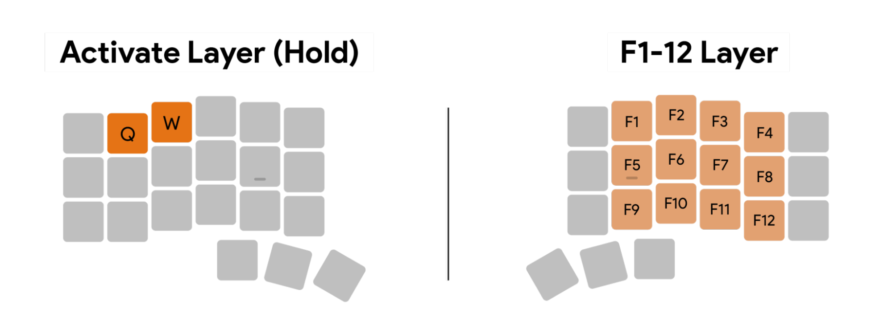
Access F1-12 by holding Q+W. Similar to the numbers, function keys are **ordered chronologically, top-down**. Q+W is placed so function keys can be easily paired with modifiers for keyboard shortcuts. Double-tap Q+W to activate this layer without the need to hold Q+W, Escape exits.

And that’s it for layers!

------

#### Important Note: If you’re just interested in reading the absolute basics to get started, only read the [“Common Symbols” section](#common-symbols) and [“Common Actions” section](#common-actions), then jump down to “Conclusion” 👍

------
## Symbol Chords
_All symbols are chorded with the right-hand, freeing the left-hand for modifiers. All symbols can be chorded from within the Number layer_.
### Common Symbols
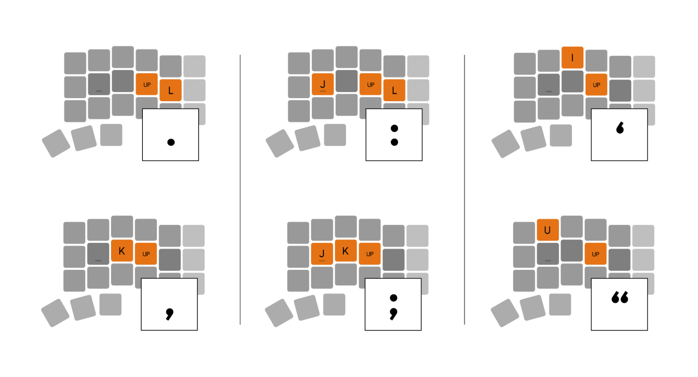
**Period** and **Comma** chords share the general placement of their QWERTY counterparts but without leaving the home row. **Colon** and **Semicolon** are the same Period/Comma chords, but with “J” also pressed. **Apostrophe** and **Quote** are each the shape of their symbol.

### Basic Math Symbols
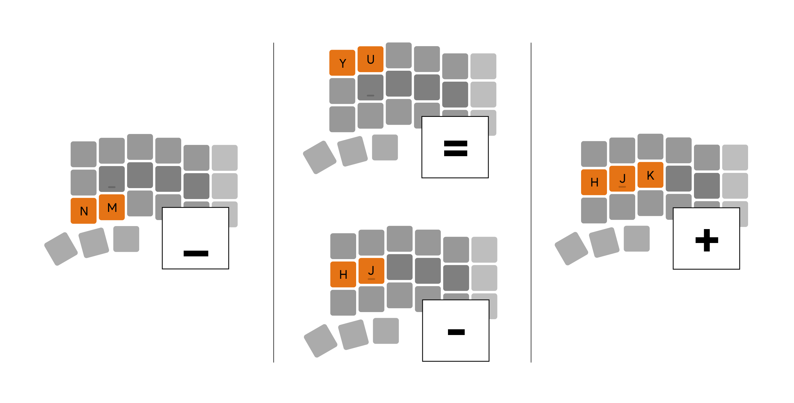
**Equals** and **Minus** are commonly used as increase/decrease shortcuts, so stacking them feels natural. Typing words like “b-U-Y” quickly may activate the Equals chord. **Plus** chord is the Minus chord with an added key. **Underscore** chord is placed below Minus since its character appears as a lowered Minus. Underscore could be activated with words like “da-M-N.”

### Parentheses
_All parentheses chords are paired next to each other. The most common regular parentheses are placed on the home row_.
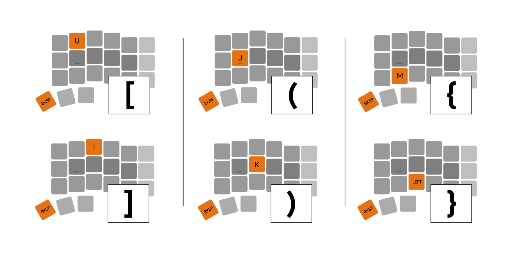

### Shapes
_These chords reference the symbols’ shapes_.
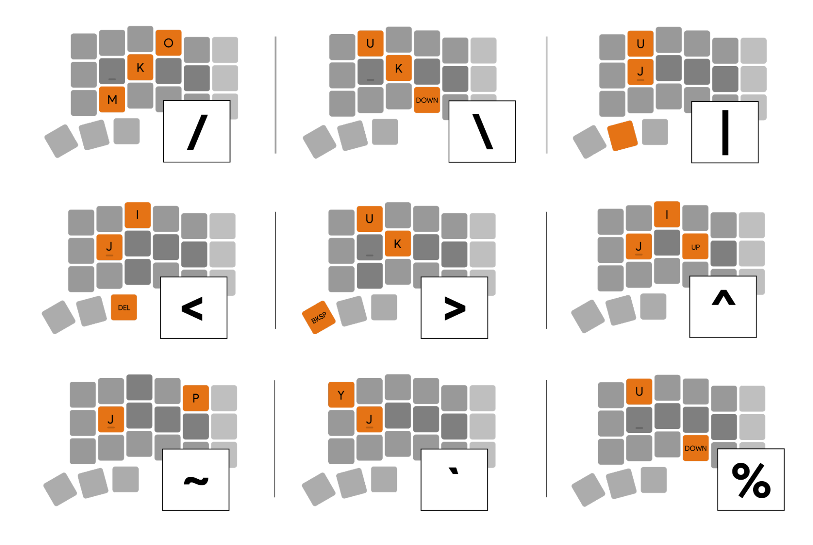

### Intonation
_These chords reference the vocal rise/fall related to these symbols_.
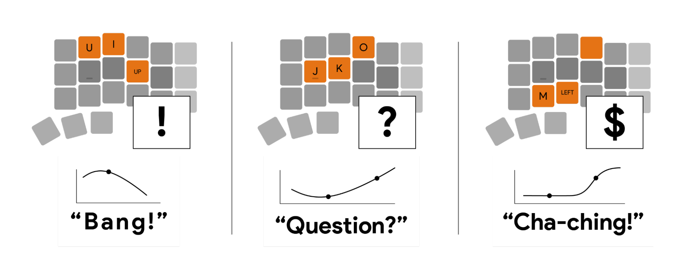

Words with an **Exclamation Point** drop in emphasis on the final syllable – this downward intonation is replicated by the shape of this chord. Inversely, words with a **Question Mark** have an inflection that starts low, ends high. The **Dollar Sign** symbol replicates a cash register’s sound. “Cha” starts lower while higher emphasis/tone is on “Ching!” 

### Association
_These chords create an association with how a symbol is used or the position of a previously established chord_.
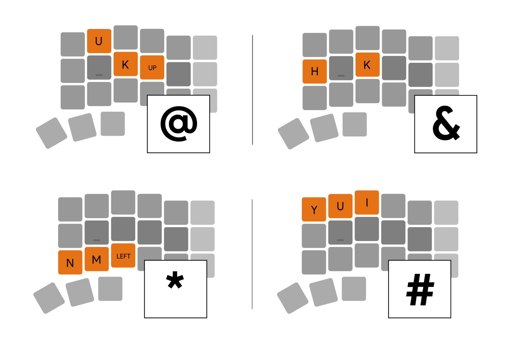

When addressing someone, one can use the **At Sign** or point at the person – this chord makes you point at the person you’re addressing. An **Asterisk** is used for footnotes at the bottom of a page – this chord uses the bottom row, where a footnote would be. The **Ampersand** uses the same chord as Plus, only with one less letter. Words like “an-K-H” may activate this chord. The **Hashtag** symbol looks like an Equals sign with two vertical lines – so, the Hashtag chord is made up of the Equals chord and the letter “I,” a vertical line. 

------
## Action Chords
### Common Actions
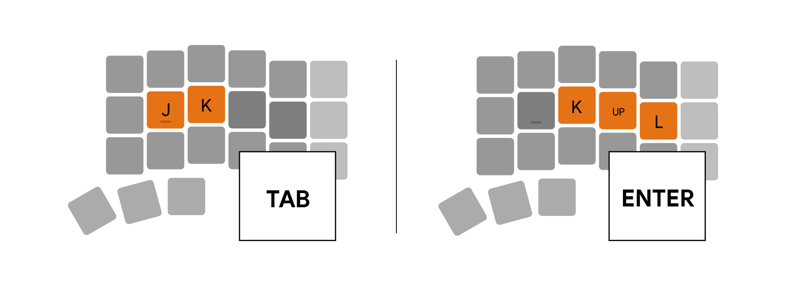
**Tab** is conveniently placed, especially for application switching, but quickly typing “J-K” may activate Tab. **Enter**’s chord is similar to its position on  QWERTY but without leaving the home row. 

### Navigation Chords
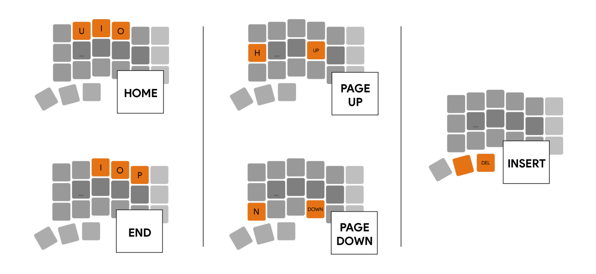
While **Home** and **End** are usually stacked vertically, these chords are horizontal since they trigger the cursor to jump left/right. End chord could be triggered with words like “P-O-I-nt.” **Page Up** and **Page Down** chords neighbor Scroll Up and Down chords in the [“Mouse Chords” section](#mouse-chords). Activating **Insert**’s “overtype” mode is similar to combining the actions of Space and Delete.

### Additional Media Chords

### Mouse Chords
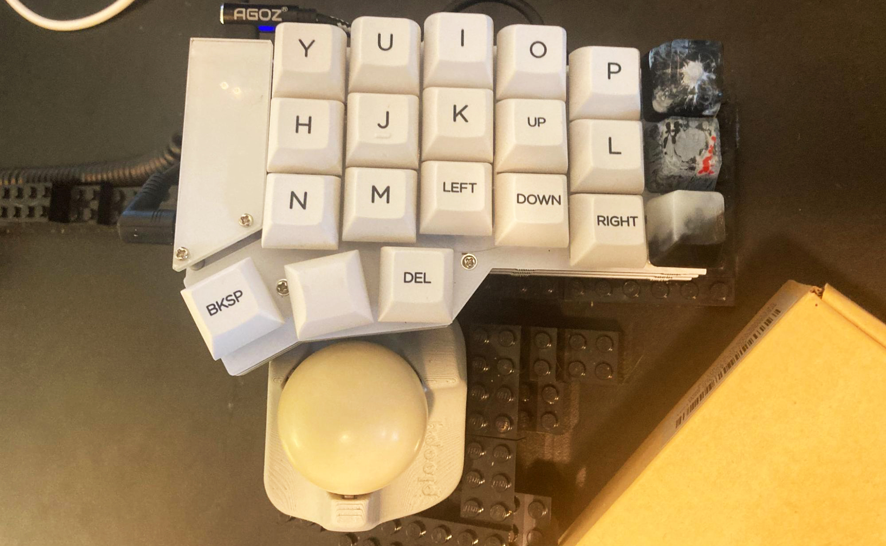

_This section requires an external trackball, as the directional mouse keys take too much time and are too imprecise. I’m using the [Ploopy Nano Trackball](https://ploopy.co/nano-trackball/)_. 
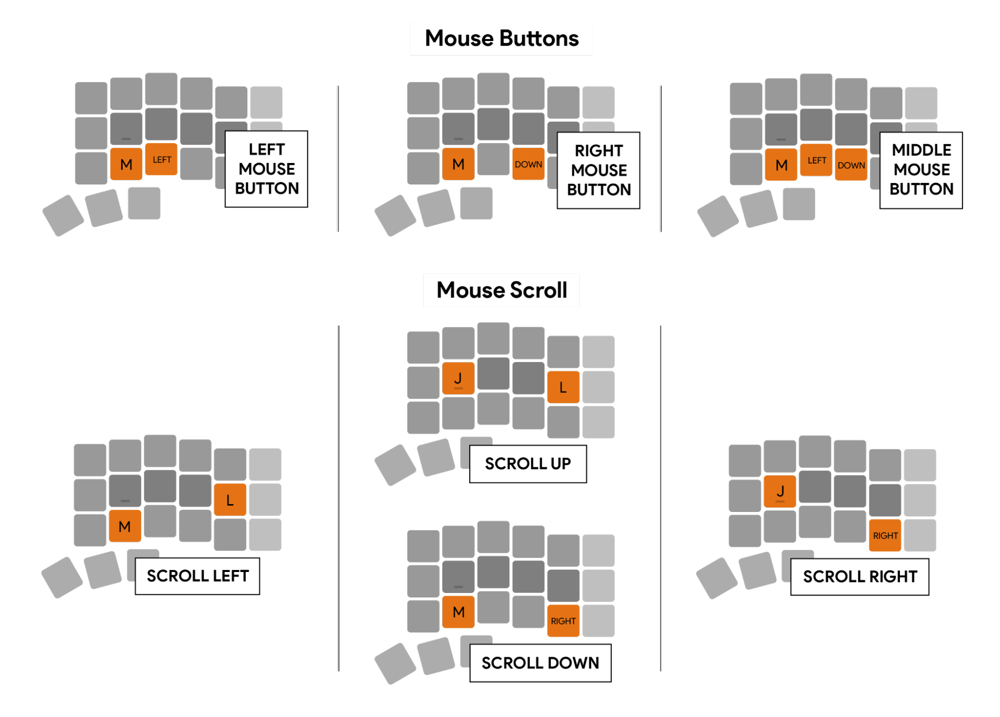
**Mouse Buttons** are placed where the trackball is comfortably accessible. **Scroll Up** and **Scroll Down** chords are one key position from Page Up/Down for quickly changing between slow and fast navigation. **Scroll Left** and **Scroll Right** physically rotate your hand to face the direction you want to be scrolling. The Scroll Left chord could trigger with words like “e-L-M.”

### Misc Chords
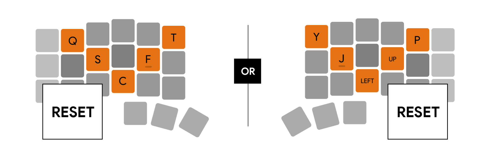
**Reset** is visually represented by the line dipping and rising. Which side you use depends on which side of the keyboard is the parent. **Swap To Mac** is M+A+C, **Swap To Windows** is [P+C+M+R](https://en.wikipedia.org/wiki/PC_Master_Race), the only chords within the Chordic layout specific to key placements on QWERTY. The chord P+C isn’t used because quickly typing “P-C” could accidentally activate this chord. Default layout is Mac. Refer to [Modifier Keys section](#modifier-keys) for more info.

------
## Conclusion

And that’s Chordic! A chording-heavy layout that focuses on instantaneousness. 

Layouts are highly personal; what works for me may not for you. I encourage experimentation and tweaking!

If you have a Corne keyboard (aka the crkbd) and want to give this a go, [here are the keymap files](https://drive.google.com/drive/folders/1fFPNvJiDUrYAS6E9FuKkzGjdH7ZOdLYQ) for download to be used with QMK, or [the compiled .hex file](https://drive.google.com/file/d/1oFlFQ3RSFimabYId-VHHeJsnoYEFJ21o/view) ready to be flashed onto your Corne keyboard with QMK Toolbox. The above links have the right side of the keyboard acting as the parent to the left side.

Feel free to [buy me a beverage](https://www.buymeacoffee.com/gfolgert), it would be greatly appreciated. Any donations will likely go right back into supporting the keyboard-enthusiast community, as well as my own keyboard addiction.

------
## Resources
* [r/ErgoMechKeyboards](https://www.reddit.com/r/ErgoMechKeyboards/)
* [Boardsource.xyz](https://boardsource.xyz/) – [Corne keyboard](https://boardsource.xyz/store/5ecc0f81eee64242946c988f) (I have this one), Corne low-profile keyboard.
* [Ben Vallack's 'Exploring Usability' YT playlist](https://www.youtube.com/watch?v=WA_GUYS8UJg&list=PLCZYyvXAdQpvysng5wxGkrnIoFtvPibXM) – Wonderful videos about split keyboards.
* [Designing a 36-key custom keyboard layout – Peter Jang](https://peterxjang.com/blog/designing-a-36-key-custom-keyboard-layout.html) – A solid 36-key layout with similar goals to mine, but with less emphasis on chording.
* [Markstos layout](https://github.com/markstos/qmk_firmware/blob/markstos/keyboards/crkbd/keymaps/markstos/README.md) – A solid 42-key layout.
* [QMK Configurator](https://config.qmk.fm/#/planck/rev6/LAYOUT_ortho_4x12) – An online tool for easily creating firmware files for QMK keyboards.
* [QMK Toolbox](https://github.com/qmk/qmk_toolbox) – Software that flashes firmware onto your keyboard.
* [QMK Configurator – Test](https://config.qmk.fm/#/test) – Double check all characters are working properly.
* [Macro Generator](https://codepen.io/mvaneijgen/full/LYEVQXp) | QMK – Type in the chord you want, this spits out the code needed. Saved me a loads of time.
* [QMK Documentation](https://docs.qmk.fm/#/) – Great resource for learning about the capabilities of QMK.
